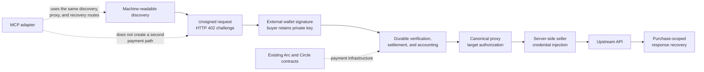

# Reusable Arc primitives in Mahshar

This document maps Mahshar's reusable infrastructure to its current source. It
is intended for Arc builders and Showcase reviewers. The modules below run as
part of the Mahshar application; they are not currently published as a package
or represented as drop-in components.

## Architecture



Mahshar does not receive buyer private keys or sign on a buyer's behalf. Seller
credentials remain server-side and are added only after target authorization.
The payment path uses existing Arc and Circle contracts; Mahshar currently
deploys no custom smart contract. MCP translates tool calls into the existing
Mahshar discovery, proxy, and recovery routes rather than maintaining a second
settlement path.

## Primitive inventory

### 1. Durable x402 settlement and payment-aware delivery

**What it does.** The settlement state machine separates verification,
settlement submission, acknowledgement, purchase accounting, upstream delivery,
and recovery. A committed submission marker prevents automatic resettlement
after an ambiguous external result. Delivery state distinguishes a proven
pre-dispatch retry from a final upstream response and an outcome whose side
effect is unknown.

**Why reuse it.** An Arc application that charges before performing an external
side effect needs stronger guarantees than a single verify-and-forward request.
This pattern provides explicit replay, duplicate-accounting, and ambiguous
outcome boundaries.

**Main implementation files.**

- `src/lib/payments/settlement.ts`
- `src/lib/payments/delivery.ts`
- `src/lib/payments/server.ts`
- `src/lib/gateway.ts`
- `src/app/api/proxy/route.ts`
- `src/app/api/proxy/[api_id]/route.ts`
- `supabase/migrations/20260923000300_x402_settlement_durability.sql`
- `supabase/migrations/20260926000200_x402_delivery_state.sql`
- `docs/security/x402-settlement-durability.md`

**Main dependencies.** `@circle-fin/x402-batching`, `@x402/core`, Node crypto,
Next.js route handlers, and PostgreSQL/Supabase functions.

**Coupling level:** High.

**Reuse status:** reference pattern only.

**Production verification.** Arc Mainnet requirements, live unsigned 402
challenge generation, and a real externally signed MCP x402 purchase have been
verified. Production evidence confirmed settlement, accounting, paid API
delivery, and same-authorization replay without duplicate payment. The state
machine also has focused local and synthetic integration coverage. The public
Memo transaction is not presented as proof of the x402 purchase.

**Known limitations.** The installed batching SDK does not provide a read-only
settlement-status lookup for resolving a lost successful acknowledgement. Such
attempts remain fenced for operator review. Accounting and storage are tied to
Mahshar's purchase schema.

**Standalone extraction needed.** Define generic facilitator, store, accounting,
and delivery adapters; replace Mahshar purchase fields and database functions;
and ship a minimal migration and route example.

### 2. Canonical target authorization and safe credential injection

**What it does.** Buyer-supplied path and query values are checked against the
seller-declared contract. The target builder rejects traversal, encoded
traversal, undeclared or duplicate parameters, and collisions with a query
credential. API-key, bearer, or query credentials are injected only after the
credential-free target is authorized.

**Why reuse it.** A paid API proxy can otherwise turn stored seller credentials
into a server-side request forgery or send a credential to a buyer-controlled
destination. The authorization-before-injection ordering is reusable beyond
Mahshar.

**Main implementation files.**

- `src/lib/marketplace/proxy-target.ts`
- `src/lib/marketplace/safe-pattern.ts`
- `src/lib/marketplace/upstream-auth.ts`
- `src/lib/marketplace/request-contract.ts`
- `src/lib/proxy.ts`
- `src/lib/outbound-fetch.ts`
- `docs/safe-listing-patterns.md`

**Main dependencies.** Standard URL APIs, Mahshar listing metadata, the shared
outbound-fetch policy, and application auth-type definitions.

**Coupling level:** Medium.

**Reuse status:** reusable with adaptation.

**Production verification.** Implemented in the production proxy path and
covered by local target, request-contract, upstream-authentication, and proxy
tests. No independent security audit is claimed.

**Known limitations.** The accepted parameter schema and outbound network
policy are Mahshar-specific. Buyer-supplied headers are intentionally not
forwarded.

**Standalone extraction needed.** Publish a neutral listing contract, remove
application type imports, expose the outbound policy as an adapter, and provide
framework-neutral request examples.

### 3. Machine-readable paid API discovery

**What it does.** Active listings are projected into a bounded public execution
contract containing method, proxy URL and style, request constraints, examples,
response wrapper, Arc network information, x402 payment domain, rate limits,
and recovery instructions.

**Why reuse it.** Agents need enough structured information to construct a
valid call and validate its payment challenge without knowing a marketplace's
source code or the seller's upstream URL.

**Main implementation files.**

- `src/app/api/agent/discover/route.ts`
- `src/lib/marketplace/agent-contract.ts`
- `src/lib/marketplace/proxy-entry.ts`
- `openapi.yaml`
- `docs/agent-integration.md`

**Main dependencies.** Next.js, Supabase, listing/request-contract metadata,
and the configured canonical marketplace origin.

**Coupling level:** Medium.

**Reuse status:** reusable with adaptation.

**Production verification.** The public discovery endpoint is live on
`mahshar.xyz` and advertises Arc Mainnet (`eip155:5042`). Discovery validation
and pagination have focused local coverage.

**Known limitations.** The DTO and listing source are versioned inside the
Mahshar application rather than as an independent schema package.

**Standalone extraction needed.** Separate the public schema and transformer
from Supabase, define a provider interface for listings, and document versioning
and compatibility rules.

### 4. MCP discovery and externally signed paid execution adapter

**What it does.** The stateless MCP endpoint exposes `search_apis`, `get_api`,
`execute_api_call`, and `get_purchase_response`. Paid execution first returns a
live challenge and prepared-call token. The caller signs outside Mahshar and
replays the identical call with the signature. Recovery uses the purchase
capability returned by the existing HTTP payment path.

**Why reuse it.** It shows how an MCP client can interact with an x402 paid API
without giving the MCP server a private key or introducing a separate payment
implementation.

**Main implementation files.**

- `src/app/api/mcp/route.ts`
- `src/lib/mcp/server.ts`
- `src/lib/mcp/discovery-client.ts`
- `src/lib/mcp/paid-client.ts`
- `src/lib/mcp/request-builder.ts`

**Main dependencies.** `@modelcontextprotocol/server`, Zod, Fetch, Mahshar's
public discovery format, and the existing proxy and recovery endpoints.

**Coupling level:** Medium.

**Reuse status:** reusable with adaptation.

**Production verification.** Public MCP discovery and end-to-end paid execution
have been verified in Production with an external client, including external
wallet signing, Arc Mainnet settlement, paid API delivery, persistent recovery,
same-authorization replay without duplicate payment, and buyer, seller, and
platform accounting. Local tests cover the adapter, bounded inputs/responses,
challenge parsing, request integrity, and synthetic proxy boundaries.

**Known limitations.** The adapter assumes Mahshar's discovery and response
contracts. Internal self-fetches may share infrastructure rate-limit identity.

**Standalone extraction needed.** Define generic discovery, paid-route, signer
handoff, and recovery interfaces; add an external-client example; and replace
Mahshar-specific result names and URLs.

### 5. Prepared-call integrity token

**What it does.** A short-lived HMAC token binds an API ID, normalized buyer
wallet, sorted path/query inputs, body presence and hash, and the public listing
execution contract. Signed execution is rejected if the call or listing changed
after challenge preparation.

**Why reuse it.** It closes the gap between obtaining an unsigned payment
challenge and submitting the externally signed request, without storing
server-side session state or accepting a buyer private key.

**Main implementation files.**

- `src/lib/mcp/prepared-call.ts`
- `src/lib/mcp/request-builder.ts`
- `tests/mcp/phase2.test.ts`

**Main dependencies.** Node crypto and the public discovery listing type.

**Coupling level:** Low.

**Reuse status:** reusable with adaptation. The algorithm is self-contained,
but configuration and public types are not yet package-neutral.

**Production verification.** Used by the live MCP endpoint and exercised in the
verified end-to-end Production paid flow. Local tests cover tamper, expiry,
canonical ordering, API binding, and listing drift.

**Known limitations.** The token expires after ten minutes and currently derives
its purpose-separated signing key from Mahshar's existing encryption secret.
There is no standalone key-rotation protocol.

**Standalone extraction needed.** Accept a dedicated signing key through an
interface, publish neutral call/listing types, and document rotation and clock
requirements.

### 6. Purchase-scoped response capability

**What it does.** A purpose-separated HMAC capability binds a purchase ID, API
ID, and normalized buyer wallet. It permits recovery through the existing
response route without a browser session and without exposing another buyer's
stored response.

**Why reuse it.** Paid external calls can complete after a client disconnects or
lose their immediate response. A narrow bearer capability provides a recovery
path tied to the accounted purchase rather than a broad account credential.

**Main implementation files.**

- `src/lib/marketplace/purchase-access.ts`
- `src/lib/marketplace/purchase-access-client.ts`
- `src/app/api/calls/last-response/route.ts`
- `docs/response-retention.md`

**Main dependencies.** Node crypto, Mahshar purchase/API records, stored API-call
responses, and the response-retention job.

**Coupling level:** Medium.

**Reuse status:** reusable with adaptation.

**Production verification.** Implemented in the HTTP proxy and MCP recovery
paths. Production recovery has been verified both during a paid flow and across
separate external-client invocations with matching response identity. Focused
local capability and isolation tests provide additional coverage.

**Known limitations.** The capability has no embedded expiry; practical response
availability is bounded by the seven-day response-retention policy. It is a
sensitive bearer value and must not be logged or shared.

**Standalone extraction needed.** Add an explicit storage lookup interface,
choose an expiry/revocation policy, use a dedicated signing key, and provide a
framework-neutral recovery handler.

## Minimal no-payment quickstart

These calls discover the current contract and inspect an unsigned payment
challenge. They do not contain a private key, payment signature, or purchase
capability and do not execute a payment.

### Discovery

```bash
curl -sS 'https://mahshar.xyz/api/agent/discover?limit=1&offset=0'
```

Choose an active listing and use its `method`, `proxy_url`, `proxy_style`, and
request contract exactly as returned. Do not derive or call its upstream seller
URL.

### Unpaid payment probe

For a fixed GET listing (`proxy_style: "path"`):

```bash
curl -i -X GET 'https://mahshar.xyz/api/proxy/<listing-id>'
```

For an envelope listing, construct the body from its discovery contract:

```bash
curl -i -X POST 'https://mahshar.xyz/api/proxy' \
  -H 'content-type: application/json' \
  -d '{"api_id":"<listing-id>","buyer_wallet":"0x<buyer-address>","method":"<listing-method>"}'
```

A valid unsigned call returns `HTTP 402` with an empty JSON body and a base64
JSON `PAYMENT-REQUIRED` header. Decode and validate the header off-chain; do not
add `Payment-Signature` unless deliberately performing a real payment. See
`docs/agent-integration.md` for the current validation contract.

## Production status

| Surface | Current status |
| --- | --- |
| Arc Mainnet site | Live at `https://mahshar.xyz`. |
| Public discovery | Live at `/api/agent/discover`; advertises `eip155:5042`. |
| Browser/HTTP paid flow | The underlying Arc Mainnet x402 settlement and delivery path has been Production-verified end to end through MCP. The browser UI itself was not independently exercised by that verification. The public Memo transaction remains separate evidence. |
| MCP discovery | Live through `search_apis` and `get_api` at `/api/mcp`. |
| MCP paid execution | Production-verified end to end with external signing, real Arc Mainnet settlement, paid API delivery, same-authorization replay without duplicate payment, and verified buyer/seller/platform accounting. |
| Purchase response recovery | Production-verified through MCP during the paid flow and across a separate client invocation, with matching response identity. |
| Seller credential isolation | Implemented in the production proxy path; credentials remain server-side and are injected after target authorization. |
| Bridge | Mainnet Bridge Kit routes and UI are implemented. No independent end-to-end production bridge transaction is claimed by this document. |
| Onramp | Circle Onramp integration is implemented but configuration- and provider-onboarding-dependent; availability is not claimed for every deployment or user. |
| Outreach and Admin systems | Product operations, not Showcase primitives. |

## Arc Mainnet evidence

### Mahshar-owned

- Platform EOA: `0x052650D1764406d702252B20B2294346A594A1ef`
- Successful Arc Mainnet transaction:
  [`0xa3efb83ad9ac4f2164d36b2579104cb7fb19c986cd623206b27387330e33fa33`](https://explorer.arc.io/tx/0xa3efb83ad9ac4f2164d36b2579104cb7fb19c986cd623206b27387330e33fa33)

The transaction is a successful call from the platform EOA to the official Arc
Memo contract. It is evidence of Mahshar's Mainnet operation, not by itself
proof of an x402 buyer purchase.

### Official Arc and Circle contracts used by Mahshar

| Contract | Address |
| --- | --- |
| Arc USDC | `0x3600000000000000000000000000000000000000` |
| Gateway Wallet | `0x77777777Dcc4d5A8B6E418Fd04D8997ef11000eE` |
| Gateway Minter | `0x2222222d7164433c4C09B0b0D809a9b52C04C205` |
| Memo | `0x5294E9927c3306DcBaDb03fe70b92e01cCede505` |

These are official Arc/Circle system contracts, not Mahshar contracts.

**Mahshar currently deploys no custom smart contract.**

## Arc Showcase submission narrative

### What reusable primitives does Mahshar expose?

Mahshar exposes reference implementations for durable x402 settlement and
payment-aware delivery, canonical proxy-target authorization before seller
credential injection, machine-readable paid API discovery, MCP discovery and
externally signed execution, prepared-call request-integrity tokens, and
purchase-scoped response recovery. They are implemented in the current
application and documented with their extraction boundaries; they are not
currently published as a drop-in package.

### What does Mahshar add beyond existing Arc reference projects?

`circlefin/arc-commerce` demonstrates purchasing application credits with USDC,
and `circlefin/arc-p2p-payments` demonstrates wallet-based peer-to-peer
payments. Mahshar adds application-layer patterns for discovering third-party
paid APIs, receiving and externally signing an x402 challenge, authorizing the
exact upstream request before injecting a seller credential, durably separating
settlement from external delivery, and recovering the response through a
purchase-scoped capability. It composes existing x402, MCP, Gateway, USDC, Arc
wallet, CCTP, and bridge infrastructure rather than claiming to have invented
those technologies.

Public MCP discovery, externally signed paid execution, Arc Mainnet settlement,
paid API delivery, persistent response recovery, same-authorization replay
without duplicate payment, and buyer/seller/platform accounting have been
verified in Production with an external client.

## Traction evidence boundary

The public catalog and its active listings are publicly observable. The
platform-wallet transaction above is operator/platform activity. Repository
tests and fixtures are synthetic and are not users or traction. No defensible
public evidence of a distinct external Mainnet user was identified during the
Showcase-readiness audit, so Mahshar does not claim an external-user count here.

## Future extraction

A small standalone repository may later extract the target authorization,
prepared-call, paid-adapter, settlement/delivery, and recovery interfaces. No
standalone repository or package has been created in this preparation pass.
